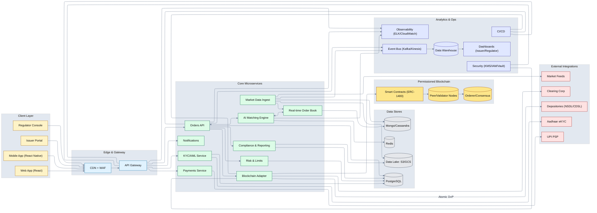

# BondFlow: Revolutionizing India's Corporate Bond Market

## Table of Contents
- [Project Overview](#project-overview)
- [Problem Statement](#problem-statement)
- [Our Solution: BondFlow](#our-solution-bondflow)
- [Key Features](#key-features)
- [Technology Stack](#technology-stack)
- [Architecture Diagram](#architecture-diagram)
- [Detailed Documentation](#detailed-documentation)
- [Knowledge Base & Playground](#knowledge-base--playground)
- [Feasibility & Scalability](#feasibility--scalability)
- [Market Impact & Alignment with SEBI's Mandate](#market-impact--alignment-with-sebis-mandate)
- [Usage](#usage)
- [Future Enhancements](#future-enhancements)
- [Team](#team)
- [License](#license)

## Project Overview

BondFlow is an innovative fintech solution designed to address the persistent illiquidity and limited retail participation in India's corporate bond market. By leveraging cutting-edge technologies like Artificial Intelligence (AI), Machine Learning (ML), and Distributed Ledger Technology (DLT/Blockchain), BondFlow aims to democratize access to corporate bonds, enhance market liquidity, and foster a more transparent and efficient financial ecosystem. Our solution aligns perfectly with SEBI's mandate of investor protection, market development, and supervision, while contributing significantly to India's financial inclusion goals.

## Problem Statement

India's corporate bond market, despite its potential, faces significant challenges:

1.  **Illiquidity:** Low trading volumes and wide bid-ask spreads make it difficult for investors to buy or sell bonds at fair prices, especially for less-traded issues. This is primarily due to a fragmented market, reliance on a dealer-centric model, and a lack of centralized, transparent trading mechanisms.
2.  **Limited Retail Participation:** High minimum investment sizes (typically ₹10 lakhs) effectively exclude the vast majority of retail investors, channeling their savings primarily into bank deposits or equities. This limits capital formation for corporations and denies retail investors access to a stable, income-generating asset class.
3.  **Lack of Transparency:** Opaque trading practices and limited real-time data hinder price discovery and create information asymmetry, particularly for retail investors.
4.  **Operational Inefficiencies:** Manual processes and fragmented systems lead to delays and higher costs in bond issuance, trading, and settlement.

These issues collectively impede the deepening of India's capital markets, increase the cost of capital for corporations, and restrict wealth creation opportunities for the common citizen.

## Our Solution: BondFlow

BondFlow proposes a comprehensive digital platform that tackles these challenges head-on:

*   **Fractionalization:** We enable the tokenization of corporate bonds into smaller, affordable units (e.g., ₹100), making them accessible to a broad retail investor base.
*   **AI-Powered Matching Engine:** An intelligent AI/ML engine facilitates efficient and transparent matching of buy and sell orders for these fractional bonds, acting as a virtual Central Limit Order Book (CLOB). This enhances price discovery and liquidity.
*   **Blockchain-Enabled Settlement:** A permissioned blockchain ensures immutable record-keeping, secure ownership transfer, and near real-time (T+0/T+1) atomic settlement, drastically reducing operational inefficiencies and counterparty risk.
*   **Intuitive User Experience:** A user-friendly mobile and web application designed for simplicity, accessibility, and investor education, including vernacular language support.
*   **Integration with DPI:** Seamless integration with India's Digital Public Infrastructure (DPI) like Aadhaar for KYC and UPI for payments, ensuring secure and efficient onboarding and transactions.

## Key Features

*   **Fractional Bond Trading:** Invest in corporate bonds with small ticket sizes.
*   **AI-Driven Price Discovery:** Smart matching engine ensures fair and efficient trades.
*   **Real-time Settlement:** Instantaneous settlement powered by blockchain technology.
*   **Comprehensive Investor Dashboard:** Track portfolio performance, view bond details, and access market insights.
*   **Gamified Investor Education:** Learn about bond markets through interactive modules.
*   **Robust Security:** Multi-layered cybersecurity architecture, including AI-powered fraud detection.
*   **Regulatory Compliance:** Built with SEBI regulations in mind, ensuring investor protection.
*   **API for Institutional Integration:** Seamless integration for banks, brokers, and wealth managers.

## Technology Stack

BondFlow is built on a robust, scalable, and secure technology stack:

*   **Frontend:** React.js (Web), React Native (Mobile) for a responsive and intuitive user interface.
*   **Backend:** Python with FastAPI for high-performance APIs and microservices architecture.
*   **Artificial Intelligence/Machine Learning:**
    *   **Matching Engine:** Reinforcement Learning, Collaborative Filtering, Graph Neural Networks (TensorFlow, PyTorch).
    *   **Fraud Detection:** Anomaly Detection (Isolation Forest, One-Class SVM), Deep Neural Networks.
    *   **Personalized Recommendations:** Collaborative Filtering, Content-Based Filtering.
*   **Blockchain/DLT:** Permissioned Blockchain (e.g., Hyperledger Fabric or an EVM-compatible enterprise chain) for tokenization (ERC-1400 standard) and immutable ledger.
*   **Databases:**
    *   PostgreSQL (Relational) for structured data (user profiles, bond master data).
    *   MongoDB/Cassandra (NoSQL) for real-time order book and market data.
    *   Data Lake (AWS S3/GCP Cloud Storage) for raw data and analytics.
*   **Cloud Infrastructure:** AWS or GCP (Compute: EC2, Lambda, Kubernetes; Networking: VPC, WAF; Storage: S3, RDS; Security: KMS, IAM; Monitoring: CloudWatch, ELK Stack).
*   **Security:** Multi-factor authentication, end-to-end encryption, secure coding practices, regular security audits.
*   **DPI Integration:** Aadhaar API for KYC, UPI API for payments.

## Architecture Diagram

Below is a high-level overview of BondFlow's architecture. A more detailed diagram can be found in the `docs/` directory.

## Detailed Documentation

For a deeper dive into specific aspects of BondFlow's design and implementation, please refer to the detailed markdown files located in the `docs/details/` directory:

*   **`ai_engine_details.md`**: Comprehensive explanation of the AI/ML matching engine, fraud detection, and recommendation systems.
*   **`blockchain_details.md`**: In-depth look at the blockchain architecture, tokenization standards, and smart contract design.
*   **`kyc_aml_details.md`**: Detailed overview of the Know Your Customer (KYC) and Anti-Money Laundering (AML) processes and their integration with DPI.
*   **`security_architecture.md`**: A granular breakdown of BondFlow's multi-layered cybersecurity framework.
*   **`scalability_strategy.md`**: Further details on how BondFlow achieves high scalability and performance.
*   **`regulatory_compliance.md`**: An elaborate discussion on BondFlow's alignment with SEBI's regulations and its approach to regulatory engagement.

## Knowledge Base & Playground

BondFlow is committed to empowering investors through education and practical experience:

*   **Knowledge Base (`knowledge_base/`):** This directory contains a rich repository of educational content on corporate bonds, investment principles, risk management, and financial literacy. It's designed to be accessible, engaging, and support learning for investors of all levels.
*   **Practice Playground (`playground/`):** A simulated environment where users can practice trading fractional bonds with virtual money, experiment with different strategies, and understand market dynamics without real financial risk. This hands-on experience complements the theoretical knowledge provided.

## Feasibility & Scalability

BondFlow is designed for real-world deployability and massive scalability:

*   **Feasibility:** Leveraging mature, enterprise-grade technologies (cloud, Python, React, Hyperledger Fabric) ensures a robust and maintainable system. Integration with existing DPIs simplifies user onboarding and payments. Our phased development approach (PoC, MVP, Public Launch) allows for iterative refinement and risk mitigation.
*   **Scalability:**
    *   **Microservices Architecture:** Allows individual components to scale independently based on demand.
    *   **Cloud-Native Design:** Leverages the elastic scalability of cloud providers to handle fluctuating workloads and millions of users.
    *   **Permissioned Blockchain:** Provides high transaction throughput and low latency compared to public chains.
    *   **AI Optimization:** The AI matching engine is continuously optimized to handle increasing transaction volumes and complexity.
    *   **Modular Design:** Enables easy addition of new features, asset classes, and integrations.

## Market Impact & Alignment with SEBI's Mandate

BondFlow's impact extends across market infrastructure, investor safety, investor access, and compliance, directly aligning with SEBI's core mandate:

*   **Market Impact:**
    *   **Deepening Capital Markets:** By unlocking retail participation, BondFlow will significantly increase the size and depth of the corporate bond market, providing a new, stable source of long-term capital for Indian corporations.
    *   **Reduced Cost of Capital:** Enhanced liquidity and broader investor base will lead to narrower bid-ask spreads and lower borrowing costs for issuers, stimulating economic growth.
    *   **Improved Price Discovery:** The transparent, AI-driven matching engine will ensure fair and efficient price discovery.
*   **Investor Protection:**
    *   **Transparency:** Blockchain provides an immutable and auditable record of all transactions.
    *   **Fraud Detection:** AI-powered systems proactively identify and prevent fraudulent activities.
    *   **Education:** Gamified modules empower investors with financial literacy.
    *   **KYC/AML:** Robust processes ensure compliance and prevent illicit activities.
*   **Market Development:**
    *   **Financial Inclusion:** Democratizes access to a new asset class for millions of small savers.
    *   **Innovation:** Introduces advanced technologies to modernize market infrastructure.
    *   **Diversification:** Offers retail investors a stable alternative to traditional investments.
*   **Supervision:**
    *   **Real-time Data for Regulators:** The platform can provide SEBI with granular, real-time data for enhanced market surveillance and regulatory oversight.
    *   **Compliance by Design:** Automated checks and reporting mechanisms streamline compliance processes.

## Usage

Once the services are running:

1.  **Access the Frontend:** Open your browser and navigate to `http://localhost:3000` (or the port specified by your frontend).
2.  **User Registration & KYC:** Complete the onboarding process, including Aadhaar-based KYC (simulated for hackathon).
3.  **Browse Bonds:** Explore available corporate bonds and their fractional units.
4.  **Invest:** Place buy orders for fractional bonds. The AI matching engine will process your order.
5.  **Manage Portfolio:** View your bond holdings, track performance, and initiate sell orders.
6.  **Learn:** Engage with the gamified educational modules to enhance your financial literacy.

## Future Enhancements

*   Integration with more DPI services (e.g., Account Aggregator).
*   Expansion to other asset classes (e.g., municipal bonds, securitized debt).
*   Advanced portfolio management tools and analytics.
*   Cross-border trading capabilities (subject to regulatory approvals).
*   Enhanced AI models for predictive analytics and personalized financial advisory.
*   Decentralized Autonomous Organization (DAO) for community governance (long-term vision).

## 👥 The Team
- **Kishore Muruganantham** – [https://github.com/KishoreMuruganantham](https://github.com/KishoreMuruganantham)
- **Mugundhan Y** – [https://github.com/MugundhanY](https://github.com/MugundhanY)
- **Mukunth AP** – [https://github.com/MukundhArul](https://github.com/MukundhArul)
- **Praveen Kumar R** – [https://github.com/praveen647](https://github.com/praveen647)
- **J. Prince Raj** – [https://github.com/the-ai-developer](https://github.com/the-ai-developer)

## License

This project is licensed under the MIT License - see the [LICENSE](LICENSE) file for details. (Note: A `LICENSE` file will be created separately.)

