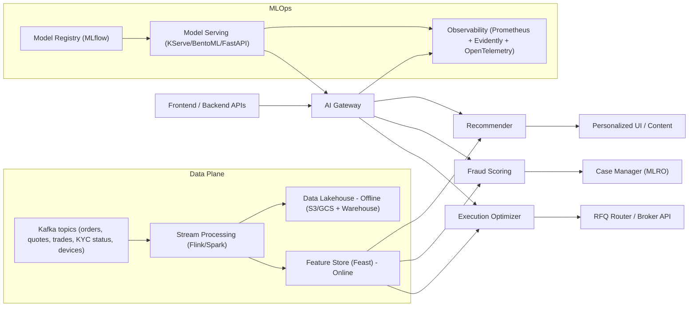

# AI Service — Core Intelligence of BondFlow

AI/ML services powering execution quality, market integrity, and personalized experiences across BondFlow. Built with streaming data, robust MLOps, and regulator-safe guardrails.

## Executive Snapshot
- Goals: Best execution (via smart RFQ/matching), proactive fraud/AML surveillance, investor personalization
- Stack: Python + FastAPI + PyTorch/TensorFlow + XGBoost + Kafka + Flink/Spark + Feast (Feature Store) + MLflow + Kubeflow/KServe
- Ops: Reproducible training, canary/shadow deploys, drift + bias monitoring, explainability and human-in-the-loop
- Compliance: DPDP-friendly data minimization, SEBI/FIU-IND alignment; model logs are evidentiary-grade

---

## 0) System Architecture



Key principles
- Pre-trade checks and compliance gating are always decisive over model suggestions.
- No off-exchange internal matching in production; AI optimizes RFQ routing, quote selection, timing, and slippage control.
- Online features mirror offline features 1:1 (parity guarantees).

---

## 1) Components Overview

| Component | Purpose | Core Methods | Latency Target |
|---|---|---|---|
| Execution Optimizer | Improve fill quality and speed via RFQ routing and price prediction | RL policy, gradient-boosted slippage model, dealer ranking, microstructure signals | p95 < 50 ms |
| Fraud Scoring | Real-time anomaly/abuse detection, AML typologies | GNN link analysis, Isolation Forest/XGB, rules hybrid | p95 < 60 ms |
| Recommender | Personalized discovery without giving “advice” | Hybrid CF + content + constraints; re-rank with suitability | p95 < 80 ms |
| Feature Store | Low-latency features for inference | Feast online (Redis/Dynamo/Memcache) | p99 < 5 ms |
| MLOps | Train/version/deploy/monitor | MLflow, Kubeflow/Airflow, KServe/BentoML, Evidently | N/A |

---

## 2) Execution Optimizer (Smart RFQ/Matching)

What it does
- Pre-trade: Predict slippage and time-to-fill, choose RFQ vs limit, pick top dealers, set guardrails (price bands, timeouts).
- In-flight: Adaptive re-quote timing, partial-fill strategy, cancellation thresholds.
- Post-trade: Benchmark vs arrival price; compute price improvement and best-ex metrics.

Signals
- Market: Live quotes, depth proxy, volatility regime, curve shifts, spread levels
- Order: Size vs depth, urgency, price band, historical fills
- Dealer: Hit ratio, quote competitiveness, response latency, rejection rates
- Compliance: KYC tranche, residency, max position/risk limits

Models
- Slippage model: XGBoost/LightGBM regression (target: bps vs benchmark)
- Dealer ranker: Learning-to-rank (LambdaMART) or contextual bandit
- RFQ policy: RL (actor-critic) in a simulator; guardrails enforce compliance/limits

Best execution metrics
- Price improvement vs mid/RFQ best
- Time-to-fill, fill ratio
- Rejection rate; re-quote count
- Adverse selection (P&L following execution)

---

## 3) Fraud Scoring and AML Analytics

Scope
- Typologies: circular/wash/self trades, layering, third-party funding, device-sharing rings, coupon-date gaming
- Signals: KYC flags, bank name match, device fingerprint, IP reputation, order velocity, graph centrality, counterparty patterns

Approach
- Rules + ML hybrid:
  - Deterministic rules for hard constraints (e.g., third-party funding)
  - Unsupervised (Isolation Forest, One-Class SVM) for novel anomalies
  - Supervised XGB/Deep nets for labeled abuse
  - GNN (PyG/DGL) for entity graphs (users, devices, bank accounts, VPAs, addresses, orders)

Workflow
- Score each event (order, funding, transfer)
- Thresholds route: block, step-up verification, or case creation
- Case Manager integration (MLRO): maker-checker, audit logs, STR package scaffolding

Metrics
- Precision/Recall, PR-AUC; alert volume; investigator time per alert
- Cost-sensitive evaluation (false negative cost >> false positive)
- Calibration (reliability curves) for consistent risk thresholds

---

## 4) Recommender (Personalized, Compliance-Safe)

Design
- Hybrid: content-based (issuer, rating, duration, YTM, liquidity, convexity) + collaborative signals (similar portfolios) + education progress
- Constraints:
  - Suitability filter: risk profile, investment horizon, KYC category
  - Diversity/serendipity: avoid concentration and echo chambers
  - No investment advice: educational framing, “why this fits your filters”

Ranking features
- Match to goals (income vs stability), ladder gaps, portfolio DV01 balance, call risk alignment, ratings trend, liquidity score

Metrics
- NDCG@K, hit rate, coverage; user actions quality (save, compare, read time, not just clicks)
- Risk alignment score; concentration penalty

---

## 5) Data & Feature Engineering

Feature Store (Feast)
- Online: Redis/Dynamo/Memcache for low-latency feature fetch
- Offline: Lakehouse (S3/GCS + Parquet/Delta) for training
- Parity: same transformations via PySpark/SQL + Python feature views

Event topics (Kafka)
- orders.v1, quotes.v1, trades.v1, kyc_status.v1, devices.v1, payments.v1, corp_actions.v1, ratings.v1

Data quality gates
- Great Expectations on batch; Deequ for invariants; schema registry for topics (Avro/Protobuf)

Privacy
- No raw Aadhaar/PAN; only derived risk flags/consent hashes
- Pseudonymized user IDs; PII join done in secure zone; DPDP consent tracked

---

## 6) MLOps: Training, Deployment, Monitoring

Training
- Orchestration: Kubeflow Pipelines or Airflow
- Tracking: MLflow (params, metrics, artifacts)
- Versioning: DVC/LakeFS for datasets; Git tags for code
- Validation: Holdout + time-split, cross-market robustness, backtests in simulator

Deployment
- Serving: KServe (KFServer) / BentoML / FastAPI microservices with autoscale
- Strategies: Shadow → Canary (5% → 50% → 100%), instant rollback
- Optimization: ONNX Runtime, quantization for CPU; GPU for GNN/RL if needed

Monitoring
- Data drift (Evidently), concept drift tests
- Live metrics: latency, error rate, throughput; model metrics (AUC, NDCG, price improvement)
- Explainability: SHAP for tabular; GNN explainers for graph features
- Governance: Approval gates; model cards; audit trails with immutable hashes

---

## 7) APIs (Draft)

AI Gateway is the single entry to model services. Auth via mTLS + JWT; quotas + rate limits.

- POST /ai/v1/exec/suggest
  - Input: order_id, isin, side, qty, limit_price, urgency, venue constraints
  - Output: recommended_mode (rfq/limit), dealer_ranked_list, price_band, timeouts, slippage_est_bps, rationale

- POST /ai/v1/fraud/score
  - Input: event_type (order/funding/withdrawal), user_id, attributes, graph_refs
  - Output: risk_score (0–1), decision (allow/review/block), reasons, features_used

- GET /ai/v1/reco/list?user_id=&k=10
  - Output: ranked bonds with explainer (“matches your 3–5Y ladder and risk profile”)

Example FastAPI skeleton:
```python
from fastapi import FastAPI, Depends
from pydantic import BaseModel
app = FastAPI()

class ExecReq(BaseModel):
    order_id: str
    isin: str
    side: str
    qty: float
    limit_price: float | None = None
    urgency: str

class ExecResp(BaseModel):
    recommended_mode: str
    dealers: list[str]
    price_band: dict
    slippage_est_bps: float
    rationale: list[str]

@app.post("/ai/v1/exec/suggest", response_model=ExecResp)
def exec_suggest(req: ExecReq):
    # fetch features from Feature Store
    # run slippage model + dealer ranker
    # assemble policy with guardrails
    return ExecResp(
        recommended_mode="rfq",
        dealers=["DEALER_A","DEALER_B","DEALER_C"],
        price_band={"min": 99.2, "max": 100.1},
        slippage_est_bps=4.7,
        rationale=["Low depth → RFQ", "Dealer_A best latency", "Tight spread window"]
    )
```

---

## 8) Training Examples

RL environment (execution policy) — sketch:
```python
import gymnasium as gym
import numpy as np

class RFQEnv(gym.Env):
    observation_space = gym.spaces.Box(low=-5, high=5, shape=(32,))
    action_space = gym.spaces.Discrete(3)  # wait, rfq_now, split_order
    def __init__(self, simulator):
        self.sim = simulator
    def reset(self, seed=None):
        self.state = self.sim.reset()
        return self.state, {}
    def step(self, action):
        next_state, fill_price, fill_qty, done = self.sim.apply(action)
        reward = -self._slippage(fill_price) - 0.1*self._time_penalty()
        return next_state, reward, done, False, {}
```

Graph snippet (fraud) with PyTorch Geometric:
```python
import torch
from torch_geometric.nn import SAGEConv

class FraudGNN(torch.nn.Module):
    def __init__(self, in_dim, hid=64, out=2):
        super().__init__()
        self.g1 = SAGEConv(in_dim, hid)
        self.g2 = SAGEConv(hid, hid)
        self.fc = torch.nn.Linear(hid, out)
    def forward(self, x, edge_index):
        h = torch.relu(self.g1(x, edge_index))
        h = torch.relu(self.g2(h, edge_index))
        return self.fc(h)
```

Feature view (Feast):
```python
from feast import Entity, FeatureView, Field
from feast.types import Float32, Int64
from datetime import timedelta

user = Entity(name="user_id", join_keys=["user_id"])
order_features = FeatureView(
    name="order_features_v1",
    entities=[user],
    ttl=timedelta(hours=6),
    schema=[Field(name="avg_order_size_7d", dtype=Float32),
            Field(name="order_velocity_1h", dtype=Float32),
            Field(name="rejections_30d", dtype=Int64)],
    online=True, source=... # Kafka/Batch source
)
```

---

## 9) Guardrails, Ethics, and Compliance

- Compliance precedence: Rule engine > AI. If any restriction triggers (KYC tranche, residency, lockup), AI suggestions are overridden.
- Best execution policy: AI logs benchmark price, suggestions, fills; evidence packaged for audits.
- Bias & Fairness: Check for disparate impact across investor cohorts; fairness-aware training; remove PII proxies.
- Privacy: DPDP-aligned consent; minimization; encrypted features; PII stays off-model unless essential with consent.
- Advice boundary: Recommendations are educational; include disclosures; show alternatives and risk flags.
- Human-in-the-loop: MLRO/compliance can override, blocklists synced immediately.

---

## 10) Security for AI Services

- AuthN/Z: mTLS between services; OAuth2 service tokens; least-privileged scopes
- Rate limits + spike arrest; input validation; schema enforcement (Protobuf/JSON Schema)
- Model integrity: Signed artifacts (Sigstore), checksums; SBOM for dependencies
- Adversarial ML: Data poisoning defenses (data contracts, outlier filters), membership inference testing, differential privacy for analytics (where applicable)

---

## 11) Evaluation & A/B Testing

Offline
- Execution: MAPE for slippage, uplift vs heuristic, coverage across regimes
- Fraud: PR-AUC, cost-weighted loss, calibration, time-to-detect
- Reco: NDCG@K, catalog coverage, risk-aligned utility

Online
- Guarded canaries with hard caps; sequential testing or CUPED to reduce variance
- Kill-switch: auto rollback on KPI breach (latency, error rate, risk thresholds)

KPIs (illustrative)
- +25–60 bps median price improvement vs baseline on small/medium tickets
- −30% investigator-hours per true-positive fraud case
- +15% watchlist conversions without increased risk concentration

---

## 12) Repo Layout (Proposed)

```
ai-service/
  services/
    exec-optimizer/        # FastAPI + models
    fraud-scoring/
    recommender/
    gateway/
  models/
    exec/                  # training code, notebooks, configs
    fraud/
    reco/
  features/
    feast_repo/
  pipelines/
    kubeflow/airflow/
  infra/
    kserve/helm/
  tests/
  docs/
```

---

## 13) Getting Started (Dev)

1) Setup
- Python 3.11; Poetry or pip-tools
- make bootstrap (installs deps, pre-commit, git hooks)

2) Env
- Copy .env.example → .env
- FEAST_ONLINE_STORE_URL=redis://...
- KAFKA_BROKERS=...
- MLFLOW_TRACKING_URI=...

3) Run services
```bash
uvicorn services.gateway.main:app --reload --port 8080
uvicorn services.exec-optimizer.main:app --port 8001
uvicorn services.fraud-scoring.main:app --port 8002
uvicorn services.recommender.main:app --port 8003
```

4) Tests
```bash
pytest -q
```

---

## 14) Contribution Guidelines (AI/ML)

- Code: Type hints, docstrings, Black/Ruff formatting, small PRs
- Experiments: Track with MLflow; push configs (Hydra) not just notebooks
- Tests: Unit tests for feature transforms; golden tests for model I/O schemas; contract tests for APIs
- Data: No PII in local/dev datasets; synthetic data for demos; DVC-managed samples
- Reviews: Security + privacy checklist; reproducibility checklist

---

## 15) Roadmap

- Phase 1: Baselines live (slippage XGB, fraud IsolationForest+rules, content-based reco); feature store v1; observability
- Phase 2: Dealer ranker + contextual bandits; GNN for fraud; hybrid reco with re-ranker; shadow deployments
- Phase 3: RL policy in simulator → canary; advanced drift/bias dashboards; explainability UI for ops
- Phase 4: Liquidity forecasting, macro regime detection, AI coach for investor education; federated learning pilot (privacy-preserving)

---

## 16) Sample Data Contracts (Schemas)

Order event (Avro-ish)
```json
{
  "type":"record","name":"OrderEvent","fields":[
    {"name":"order_id","type":"string"},
    {"name":"user_id","type":"string"},
    {"name":"isin","type":"string"},
    {"name":"side","type":{"type":"enum","name":"Side","symbols":["BUY","SELL"]}},
    {"name":"qty","type":"float"},
    {"name":"limit_price","type":["null","float"],"default":null},
    {"name":"ts","type":"long"}
  ]
}
```

Dealer performance feature
```json
{
  "dealer_id":"DEALER_A",
  "hit_ratio_30d":0.62,
  "avg_response_ms":180,
  "quote_edge_bps":-3.1,
  "rejection_rate":0.08,
  "updated_at":"2025-09-05T09:00:00Z"
}
```

---

## 17) Ops Notes

- Latency budgets include feature fetch; keep models lightweight for hot paths
- Autoscale on RPS and tail latency; prefer CPU for inference unless GNN/RL heavy
- Blue/green deploys with warmup; avoid cold starts on critical paths
- Cost control: Spot nodes for training; nightly training windows; model distillation for prod
