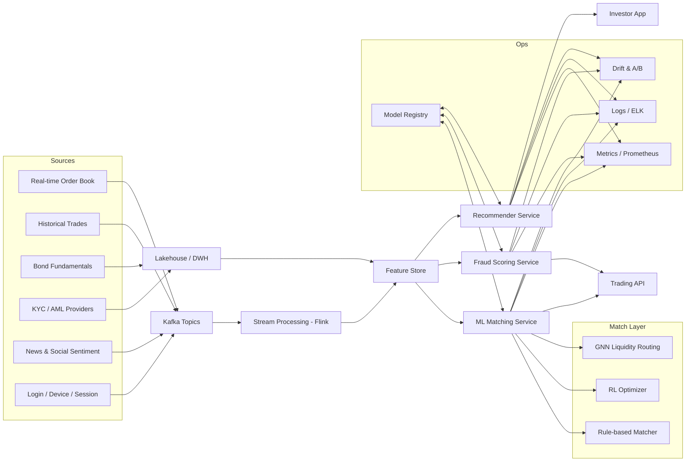

# BondFlow AI/ML Engine — Expanded Design and Implementation Blueprint

This document deepens the original overview with concrete architectures, data flows, guardrails, and measurable targets. It is framed as an implementation blueprint to avoid ambiguity. Example values and targets are illustrative and subject to validation.

## At a glance

- Hybrid matching: rule-based core + ML optimizers (RL, GNNs, CF) with strict safety constraints and instant fallback to deterministic logic.
- Fraud defense-in-depth: unsupervised anomaly detection, supervised classification, and graph-based ring detection with human-in-the-loop case handling.
- Personalized insights: hybrid recommenders, suitability-aware ranking, explainability, and market-aware risk profiling.
- Modern MLOps: streaming feature store, model registry, canary rollouts, observability, drift detection, and continuous retraining pipelines.
- Privacy and security by design: data minimization, tokenization, encryption, RBAC, and compliance-enabling controls (e.g., auditability, retention, and lineage).

---

## 0) High-Level Architecture



---

## 1) AI Matching Engine

### 1.1 Algorithm Design (Hybrid)

- Price–time priority baseline (deterministic, audited):
  - Immediate execution for exact matches (fractional tokens) with strict checks:
    - Price bands (e.g., ±X bps from mid)
    - Max sweep size per step
    - Trading calendar/holiday awareness
    - Clean vs dirty price handling (accrued interest)
    - Settlement parameters (e.g., T+2 fixed-income norms)
- ML Optimization layers (only if constraints satisfied):
  - Reinforcement Learning (RL)
    - Goal: minimize effective spread and slippage, maximize fill-rate and price improvement while minimizing market impact.
    - State (examples): current LOB snapshot features, volatility regime, time-of-day, order size relative to ADV, position/limits, historical response to similar actions.
    - Actions: slice size, posting vs taking, venue/route choice, delay/accelerate, iceberg depth.
    - Reward: weighted sum of fill quality, spread improvement, adverse selection penalty, impact penalty, latency penalty.
    - Safety: constrained RL (Lagrangian or reward shaping) with hard guards that cannot be overridden.
    - Training: offline in a market simulator (replay of historical order books); periodic on-policy fine-tuning in shadow mode before promotion.
  - Graph Neural Networks (GNNs)
    - Graph: nodes = active orders/liquidity pools; edges = execution likelihood/compatibility (price proximity, time decay, historical counterparty success).
    - Output: match probabilities and optimal routing path(s) to uncover hidden liquidity and multi-leg chains.
  - Collaborative Filtering (CF)
    - Purpose: infer complementary liquidity supply/demand from investor similarity (preferences, bond sectors, maturity buckets).
    - Application: suggest cross-instrument matches and warm liquidity for less-traded bonds.
- Fallbacks and safety modes:
  - Any ML disagreement with rule-based safety -> revert to rule-based only.
  - Degradation policies under stress (latency spikes, data gaps): disable RL/GNN, enforce IOC/limit-only.

### 1.2 Fixed-Income–Aware Data Inputs and Features

- Real-time order book (NBBO-like consolidation if multi-venue), including:
  - L1–L10 depth, imbalance, queue position estimates
  - Volatility proxies: short-term realized vol, microprice changes
- Historical executions: fill rate by slice size, slippage vs mid, time-to-fill distributions.
- Bond fundamentals:
  - Coupon, frequency, day count convention, next coupon date, call/put features, seniority, rating, sector, duration/convexity, liquidity scores.
  - Clean vs dirty price mechanics with settlement date.
- Microstructure context: time-of-day seasonality, liquidity regime, event windows (issuance, rating actions).
- User behavior: typical order sizes, urgency tolerance, partial-fill tolerance, prior venue preferences (anonymized).
- Data quality and time sync:
  - Idempotent ingestion (dedupe), schema validation, late-arrival handling.
  - Time synchronization (PTP/NTP), monotonic clocks for sequencing.

### 1.3 Execution Policies and Optimization Goals

- Order types: Limit, Market-with-protection, IOC, FOK, GTC/GTD, Iceberg, Peg-to-mid with guardrails.
- Slicing strategies: TWAP/VWAP variants, POV, adaptive child-order sizing via RL.
- Optimization targets (example priorities):
  - Maximize match rate and size-adjusted fill-rate.
  - Minimize bid–ask spread and realized slippage.
  - Minimize market impact (participation caps, volatility-aware).
  - Ensure fair price discovery (price-time priority, transparent tie-breaking).
  - Respect investor and market constraints (suitability, position limits).

### 1.4 Controls, Compliance-Enabling Features, Fairness

- Hard risk checks: price collars, fat-finger limits, notional caps, duplicate order suppression, circuit breakers, kill switch.
- Fair access: deterministic tie-break when equal; no preferential routing that disadvantages comparable orders.
- Auditability: full decision traces (inputs, features, model version, policy path, explanations) retained per policy.
- Explainability: per match, emit a short rationale (e.g., “mid-improving slice with 12ms expected latency; price band within 5 bps; impact penalty low”).

### 1.5 Evaluation Metrics (Monitored continuously)

- Execution quality: fill-rate, time-to-first-fill, time-to-full-fill, price improvement, realized slippage, markout (1s/5s/60s).
- Liquidity: spread dynamics, depth near touch, cancellation ratios, queue position outcomes.
- Robustness: p50/p95/p99 latency, error rates, fallback activations, data gap handling.
- Fairness: distribution of execution quality across order sizes and counterparties; explainability coverage.

### 1.6 Pseudocode (Illustrative)

```python
def route_order(order, lob_state, features, guards, models):
    # Hard guards first
    if not guards.within_price_bands(order, lob_state):
        return reject("Price band")
    if guards.violates_limits(order):
        return reject("Risk limit")

    # Direct exact match
    match = rule_based_exact_match(order, lob_state)
    if match:
        return execute(match)

    # ML augmentation candidates
    candidates = rule_based_candidates(order, lob_state)

    # Safety envelope for ML
    safe_candidates = [c for c in candidates if guards.safe(c)]

    # RL scoring for slicing/route
    rl_action = models.rl_policy.select_action(
        state=features.state(), candidates=safe_candidates
    )

    # GNN liquidity routing
    gnn_scores = models.gnn.rank_routes(
        safe_candidates, context=features.graph_context()
    )

    plan = combine(rl_action, gnn_scores, tie_break=price_time_priority)
    if not guards.safe(plan):
        plan = deterministic_fallback(order, lob_state)

    return execute(plan)
```

---

## 2) Fraud Detection System

### 2.1 Techniques (Ensemble)

- Unsupervised anomaly detection:
  - Isolation Forest, One-Class SVM, deep autoencoders for sequence anomalies.
  - Indicators: size spikes, smurfing patterns, velocity and geolocation anomalies, device switching, night-hour bursts, rapid fund flows to high-risk endpoints.
- Supervised classification:
  - Gradient boosting (XGBoost/LightGBM), calibrated probabilities (Platt/Isotonic).
  - Features: value, frequency, counterparties, IP ASN, device fingerprint entropy, behavioral biometrics, historical flags, graph centrality scores.
- Graph learning and analytics:
  - GNNs on transaction/user graphs to expose rings, layering, and coordinated manipulation.
  - Community detection, risk propagation (label spreading), cycle detection, suspicious star/chain motifs.
- Rule packs (deterministic, tunable):
  - Sanctions/PEP screening, country risk, velocity rules, structuring thresholds, wash trading indicators.

### 2.2 Data Sources and Feature Engineering

- Transaction logs (trades, deposits/withdrawals), with enrichment: jurisdiction tags, currency, on/off-ramp details.
- KYC/identity (hashed/tokenized): verification status, doc types, age bands, risk ratings.
- Device/Session: device IDs, cookie stability, IP geolocation, proxy/VPN/Tor labels, login time patterns.
- External watchlists: sanctions lists, adverse media.
- Sentiment/news signals for issuer-related manipulation risk.

Privacy: minimize PII in features (hash, tokenize, or embed); sensitive attributes only when necessary with strict access controls.

### 2.3 Real-time Monitoring and Response

- Streaming scoring: < X ms target latency per event (example: p99 <= 50 ms).
- Unified risk score: calibrated 0–1 with thresholds for triage:
  - Low: log only, periodic review
  - Medium: additional verification, soft friction
  - High: immediate hold, KYC refresh, case creation
- Case management workflow:
  - Evidence pack: features, model scores, explanation (SHAP), graph snapshots, similarity to past cases.
  - Human-in-the-loop decisions, action templates, audit trail.
- Adaptive thresholds:
  - Feedback loop from analysts to retrain/calibrate and reduce false positives.

### 2.4 Governance, Explainability, and Drift

- Model registry and versioning with approval workflow.
- Explainability:
  - Global: top features by class.
  - Local: per-event SHAP values and graph-based reason codes.
- Performance monitoring:
  - TPR, FPR, precision at k, cost per investigation, time-to-resolution.
- Drift detection:
  - Input distribution drift, population stability index (PSI), score drift; alerts and staged retraining.

### 2.5 Controls and Safeguards

- Hard blocks: sanctions matches, known bad devices, previously confirmed colluders.
- Rate limits: per account, device, and IP.
- Privacy/security:
  - Encryption in transit/at rest, key management, RBAC, least privilege.
  - Data retention aligned to regulatory requirements; example: multi-year retention for auditability.

---

## 3) Personalized Recommendations and Investor Insights

### 3.1 Recommendation Algorithms

- Content-based: embeddings over bond attributes (rating, duration, sector, maturity ladder, coupon type).
- Collaborative filtering: matrix factorization or neural CF; regularized, with popularity de-biasing.
- Hybrid approach: weighted/stacked models + diversity constraints to avoid narrow funnels.
- Contextual bandits:
  - Online learning to optimize top-N lists (clicks, saves, trades) with exploration limits.
- Suitability and compliance constraints:
  - Filter or down-rank items outside the user’s risk tolerance or regulatory suitability.
  - Exclude conflicts (e.g., promotional bias); log rationale.

Cold-start handling: popularity prior + content-based similarity + lightweight KYC-derived risk bands.

### 3.2 Investor Insights

- Dynamic risk profiling:
  - Observed volatility of portfolio, drawdown sensitivity, concentration risk, credit exposure heatmap.
- Market sentiment and alerts:
  - Bond- or issuer-level sentiment trend, rating-change watch, event risk windows.
- Portfolio analytics:
  - Cashflow and duration matching, scenario shocks (rate +100 bps, credit spread widening).
  - Laddering suggestions to smooth maturities.
- Education personalization:
  - Content pathways keyed to user actions (e.g., yield vs price, duration basics, callable bond risks).

### 3.3 Explainability and UX

- Each recommendation: short explanation (“Similar to your A-rated 3–5y holdings; improves ladder in 2027–2029; within risk band”).
- Controls: opt-outs, feedback (“Show fewer long-duration”, “Prefer investment-grade”).
- Frequency caps to avoid over-notifying.

### 3.4 Metrics

- Engagement: CTR, save rate, trade conversion, dwell time.
- Quality: recommendation diversity, coverage, suitability compliance rate.
- A/B testing: uplift, win probability, long-term retention impact.

---

## 4) Technology, MLOps, and Deployment

### 4.1 Data and Feature Platform

- Streaming: Kafka topics per domain (orders, trades, sessions, risk events).
- Stream processing: Flink for joins, aggregations, and feature materialization with exactly-once semantics.
- Batch: Spark for backfills, training datasets, and simulations.
- Feature store: online/offline parity (e.g., Feast), with point-in-time correctness.
- Data quality: validation (e.g., Great Expectations), schema registry, SLAs, lineage tracking.

### 4.2 Model Development and Serving

- Frameworks: PyTorch, TensorFlow, scikit-learn; Python-first services.
- Serving: FastAPI microservices, containerized with Docker, orchestrated via Kubernetes (EKS/GKE).
- Acceleration: CPU for classic models; GPU/ONNX runtimes for GNNs/RL where latency budget allows.
- Caching: feature/result caches for hot paths; circuit breakers and backpressure for resilience.

### 4.3 CI/CD and Release Management

- Model registry (versions, metadata, approvals).
- Automated unit/integration/e2e tests; reproducible training with data versioning.
- Canary and shadow deployments:
  - Shadow scoring without user impact; compare KPIs before promotion.
- Rollback: one-click rollback to last known-good model or rule-only mode.

### 4.4 Observability and Reliability

- Metrics and dashboards (Prometheus/Grafana): latency percentiles, error rates, drift indicators.
- Tracing (OpenTelemetry): end-to-end request spans for root-cause analysis.
- Logging (ELK/Cloud-native): structured logs with redaction for PII.
- SLOs (examples; to be validated):
  - Matching inference p99 <= 20 ms; availability >= 99.9%
  - Fraud scoring p99 <= 50 ms
  - Recommender p99 <= 100 ms
- Chaos and load testing: scheduled to validate failover and scaling.

### 4.5 Security and Privacy

- Encryption: TLS in transit; AES-256 at rest.
- Access control: RBAC/ABAC, service mesh policies, just-in-time secrets.
- Data minimization: collect only what is needed; tokenize/hash sensitive fields.
- Auditability: immutable logs, time-stamped decisions, model/feature versions.
- Retention and deletion: policies aligned to applicable regulations; documented DSR/erasure workflows.

---

## 5) Fixed-Income Specifics and Edge Cases

- Accrued interest and dirty pricing: accurate computation per day-count convention; settlement-aware.
- Callable/puttable/sinking features: priced-in optionality tags for recommendations and risk analytics.
- Liquidity proxies: quote-to-trade ratios, dispersion metrics, last-trade decay.
- Cross-currency and hedging context: FX basis when relevant to routing or insights.
- Market calendars: holiday schedules, early closes, coupon calendars for cashflow projections.

---

## 6) Example KPIs and Targets (Illustrative)

| Area    | KPI                         | Target (example) | Notes                          |
|---------|-----------------------------|------------------|--------------------------------|
| Matching| Size-adjusted fill rate     | +5–10% vs baseline | Validated in A/B + simulator |
| Matching| Price improvement           | ≥1–3 bps avg     | Bond/liquidity dependent       |
| Matching| p99 inference latency       | ≤20 ms           | Under typical load             |
| Fraud   | Precision at top 1% alerts  | ≥60–75%          | Tuned to workload              |
| Fraud   | False positive rate         | ≤2–5%            | With human feedback loop       |
| Reco    | Trade conversion uplift     | +3–7%            | Against control                |
| Reco    | Suitability violations      | 0                | Enforced via hard filters      |

All targets require calibration on real data and may vary by market regime.

---

## 7) Testing, Simulation, and Rollout

- Historical replay and simulation:
  - Market simulator for RL; counterfactual evaluation for matching and recommendations.
  - Backtests across calm, volatile, and illiquid regimes.
- Red team/adversarial testing:
  - Fraud tactics (smurfing, layering, device farms), manipulation scenarios.
- Phased rollout:
  - Stage 1: Shadow mode with live comparison.
  - Stage 2: Canary (1–5% traffic), automatic rollback if guardrails trip.
  - Stage 3: Gradual scale-up with continuous monitoring.
- Documentation:
  - Model cards, data sheets, decision logs, change management records.

---

## 8) Example RL Reward (for clarity)

Let:
- r_fill = normalized fill quality (size, speed)
- r_spread = negative of executed spread vs mid
- r_impact = penalty for short-term markout/adverse selection
- r_latency = penalty if inference/route adds delay
- r_violation = large penalty for any soft-constraint breach (hard constraints block earlier)

Reward at step t:
- As code: `R_t = w1*r_fill + w2*r_spread - w3*r_impact - w4*r_latency - w5*r_violation`
- Weights w1..w5 tuned offline, then refined online with constraints active.

---

## 9) What’s Instrumented for Transparency

- For every automated decision:
  - Input snapshot references (order book hash, features hash)
  - Model and feature versions
  - Decision path (rule-only vs RL/GNN assisted)
  - Explanation (top features, reason codes)
  - Outcome metrics (fill, price improvement, risk action)
- Aggregated reports:
  - Execution quality by segment, fairness lenses
  - Fraud detection effectiveness and case outcomes
  - Recommendation suitability and diversity

---

## 10) Open Design Choices (to finalize with stakeholders)

- RL flavor: Conservative (CQL) vs constrained policy gradient; offline-to-online cadence.
- GNN architecture: GraphSAGE vs GAT; latency vs accuracy trade-off.
- Feature store tech: managed vs self-hosted; online latency and consistency guarantees.
- Thresholding strategy: fixed vs dynamic thresholds by regime for fraud scoring.
- Privacy enhancements: consider differential privacy on aggregate insights where applicable.
