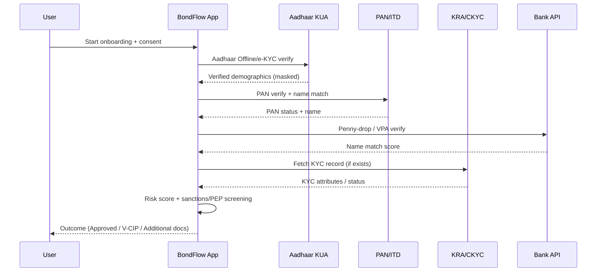
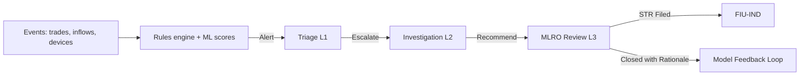

# BondFlow KYC/AML Program — Design, Controls, and Ops

Compliance-first, DPI-powered onboarding and surveillance for a regulated corporate bond marketplace. Risk-based, privacy-preserving, and audit-ready.

## 0) Regulatory Anchors & Scope

- Laws/Rules
  - PMLA 2002 and PML Rules 2005 (as amended)
  - SEBI Master Circular on AML/CFT (and intermediary-specific circulars, incl. V-CIP)
  - SEBI KYC/KRA framework and KRA validation norms
  - FIU-IND reporting framework (STR; CTR/CBWTR/NTR as applicable)
  - DPDP Act 2023 (privacy and data governance)
  - FEMA considerations for non-residents (phase-dependent)
- DPI & National Systems
  - Aadhaar (e-KYC via KUA partner; Offline XML/VID)
  - PAN verification (Income Tax APIs)
  - CKYC (CERSAI) and SEBI KRAs (fetch/validate/publish)
  - DigiLocker (OVDs, address proofs), eSign
  - UPI/RTGS/NEFT rails; penny-drop bank name validation

Note: No cash acceptance. First-party funding only (same-name bank accounts). Cross-border participation subject to FEMA/SEBI approvals.

---

## 1) KYC — Identity & Eligibility

### 1.1 Customer Types and Required KYC

| Customer Type | Core IDs | Additional | Verification Sources |
|---|---|---|---|
| Individual (Resident) | PAN + Aadhaar (Offline XML/VID/e-KYC via KUA) | Address proof (DigiLocker OVD), bank account, selfie (V-CIP if required) | PAN-ITD, UIDAI, DigiLocker, KRA, CKYC |
| Individual (NRI/OCI) | PAN, Passport | OCI/PIO, foreign address proof, FATCA/CRS, tax residency | PAN-ITD, DigiLocker (where issuers available), notarized/consular docs |
| Company | CIN, PAN (entity), GSTIN (if any) | MOA/AOA, Board resolution, AoA, UBOs (≥10%), authorized signatories | MCA21, PAN-ITD, GSTN, CKYC/KRA |
| LLP/Partnership | PAN, LLPIN/Regn | Partnership deed/LLP agreement, UBOs (≥10%), signatories | MCA21/Registrar, PAN-ITD |
| Trust/Society | Registration cert, PAN | Trust deed/bylaws, trustees, settlor, beneficiaries, UBOs | Registrar, PAN-ITD |
| HUF | PAN (HUF), PAN (Karta) | HUF declaration, address proofs | PAN-ITD |

- UBO threshold: Identify and verify beneficial owners at ≥10% ownership/control (per current PML Rules). For trusts, identify settlor, trustees, protector (if any), beneficiaries exercising control, and any other natural persons exercising ultimate effective control.

### 1.2 Onboarding Paths (Individual)

- Aadhaar Offline e-KYC (preferred)
  - User uploads UIDAI-signed XML/QR + share code. We verify signature; ingest masked PII.
- Aadhaar e-KYC via KUA partner (OTP)
  - With explicit consent; BondFlow integrates through an approved KUA/Sub-KUA.
- Non-Aadhaar OVD fallback
  - Passport/Driving License/Voter ID via DigiLocker pulls; name/address validation.
- PAN Verification
  - Name and PAN status query; fuzzy match tolerance with explainability; mismatch resolution workflow.
- Bank Account Verification
  - Penny-drop name check; mandate that bank name ≈ KYC name (Jaro/Jaro+); VPA verification for UPI.
- KRA/CKYC
  - Fetch by PAN/Aadhaar/CKYC number; reconcile attributes; publish updates back to KRA where required.
- FATCA/CRS (where in-scope)
  - Self-certification; indicia checks; GIIN validation for entities; periodic refresh.

### 1.3 Video KYC (V-CIP)

- When triggered by risk or regulation: secure, encrypted session with
  - Liveness detection, random prompts, geo-tagging/IP heuristics
  - OCR + match of OVDs; selfie–ID face match
  - Session recording, time-stamped, hash-anchored
- Controls per SEBI’s V-CIP standards; no biometric storage.

### 1.4 Risk-Based CDD & Refresh

- Initial Risk Rating: Low / Medium / High (auto + analyst review for edge cases)
  - Factors: Document strength, residency, occupation/industry, PEP status, adverse media, geographic risk, expected activity
- Periodic Review Cadence
  - Low: 36 months; Medium: 24 months; High/PEP: 12 months
- Triggered Reviews
  - Profile changes, unusual activity, sanction/PEP hit, negative news, device anomaly, bank name mismatch, UBO change

---

## 2) AML — Screening, Monitoring, Reporting

### 2.1 Sanctions, PEP, and Adverse Media Screening

- Lists
  - UN, OFAC, EU, HMT; Indian: MHA/UAPA, SEBI debarred, RBI defaulters/advisories; Local law enforcement notices where syndicated
- Cadence
  - At onboarding, name updates, periodic (daily delta), and pre-settlement checks for high-risk transfers
- Matching
  - Fuzzy name match with transliteration coverage; DOB/address confirm; watchlist scoring; manual disposition (true/false/possible)
- PEP
  - Domestic and foreign PEPs; relatives/close associates; EDD with senior management sign-off, source-of-wealth evidence, enhanced monitoring

### 2.2 Transaction Monitoring (Real-Time + Batch)

- Objectives: Detect placement/layering/integration typologies, market abuse adjacency (wash/circular/self-trades), and third-party funding risks
- Deterministic Rules (illustrative)
  - Velocity: >N trades or redemptions within T minutes beyond baseline
  - Structuring: Multiple near-threshold credits/debits within rolling window
  - Third-party Funding: Inflows from non-registered bank accounts or mismatched name
  - Jurisdiction Risk: Counterparties or banks linked to high-risk jurisdictions
  - Rapid In-Out: Buy and sell same/few ISINs with minimal holding period at loss
  - Coupon Laundering: Frequent transfers pre-record date; profitless trades around coupon dates
  - Address/Device Risk: Shared device/IP across multiple accounts with coordinated activity
- Behavioral/ML
  - Unsupervised clustering for peer-group deviation
  - Supervised models (when labeled cases exist) for suspiciousness scoring
  - Graph Neural Networks: multi-hop linkage via shared KYC attributes, devices, bank accounts, VPAs; circular trade detection; beneficial-ownership inference
- Case Management
  - Alert triage (L1), investigation (L2), MLRO review (L3)
  - Attachments, notes, timeline, verdict, regulatory filing artifacts
  - Feedback loop to recalibrate rules and ML thresholds (reduce FPs)

### 2.3 Reporting to FIU-IND (as applicable)

- STR (Suspicious Transaction Report)
  - Filed by MLRO promptly upon forming suspicion; no tipping-off to customer
- CTR (Cash Transaction Report), CBWTR (Cross-Border Wire Transfer Report), NTR (Non-Profit Org Transactions)
  - Filed where product/flows qualify; BondFlow design avoids cash; cross-border flows restricted unless explicitly enabled and compliant
- Record-keeping
  - As per PML Rules minimums; evidentiary logs and data retained per legal holds

Notes: Thresholds and timelines follow current FIU-IND/SEBI guidance; BondFlow maintains a compliance calendar with automated reminders and maker–checker controls.

---

## 3) Privacy, DPDP, and Data Security

- DPDP Alignment
  - Notice and Consent: Clear purpose-specific consent; granular toggles for optional profiling
  - Data Minimization: Collect only necessary attributes; redact where feasible
  - Storage Limitation: Retain for regulatory minimums; longer only under legal basis (audit/legal hold)
  - Data Principal Rights: Access/correction/erasure (subject to legal retention); grievance redressal; DPO appointed
  - Localization: PII stored in India; cross-border transfers controlled by contractual and regulatory safeguards
- Security Controls
  - Encryption: AES-256 at rest; TLS 1.2/1.3 in transit; database field-level encryption for sensitive fields
  - Key Management: HSM-backed keys; rotation; dual-control for key ceremonies
  - Access: Fine-grained RBAC/ABAC; JIT access; MFA; PAM for privileged ops; immutable admin audit logs
  - AppSec: SAST/DAST/SCA in CI/CD; SBOM; secret scanning; least-privileged microservices
  - Monitoring: SIEM + UEBA; DLP; tamper-evident logs with hash anchoring

---

## 4) Blockchain-Integrated Compliance

- On-Chain Attestations (no raw PII)
  - Store hashed KYC status, risk tier, KRA/CKYC references, and timestamped consent proof
- Protocol-Level Controls
  - ERC-1400 partitions: allowlists, residency tranches, lockups
  - Controller transfers for regulatory/legal actions
  - Pre-trade checks: smart contracts query KYC/AML oracle before settlement
- Regulator Visibility
  - SEBI node with read/audit access; Merkle-proof backed evidence trails
- Optional ZK Attestations
  - Zero-knowledge proofs for attributes like “KYC-verified”, “non-PEP”, “resident” without exposing PII

Example on-chain compliance attestation (conceptual):
```json
{
  "subject": "did:bondflow:INV12345",
  "kyc_status": "verified",
  "risk_tier": "medium",
  "partitions_allowed": ["IND_RESIDENT_QIB", "IND_RESIDENT_RETAIL"],
  "pep_flag": false,
  "sanctions_clear": true,
  "kra_ref": "KRA-XYZ-2024-09-123456",
  "ckyc_no": "XXXX-YYYY-ZZZZ",
  "consent_hash": "0x8f...ab",
  "attestor": "did:bondflow:compliance",
  "valid_till": "2026-09-01T00:00:00Z",
  "sig": "0x..."
}
```

---

## 5) Process Flows

### 5.1 Onboarding (Individual)



### 5.2 Monitoring & STR Workflow



---

## 6) Risk Scoring and Rulebook

### 6.1 Scoring Dimensions (illustrative weights)

| Dimension | Examples | Weight |
|---|---|---|
| Identity strength | Aadhaar Offline/KRA validated vs. OVD only | 15% |
| Residency/jurisdiction | Resident vs. cross-border high-risk | 15% |
| PEP/sanctions/adverse media | Flags and proximity scores | 20% |
| Financial profile | Declared income, bank validation, SoF/SoW | 15% |
| Behavioral profile | Device hygiene, IP reputation, velocity | 15% |
| Product/Instrument risk | Complex instruments, leverage (N/A for bonds) | 10% |
| Counterparty/network | Shared attributes, cluster risk, GNN centrality | 10% |

Risk tiers:
- Low: score ≤ 30
- Medium: 31–60
- High: > 60 (EDD required, senior mgmt approval for onboarding/limits)

### 6.2 Sample Rule Snippets (YAML)

```yaml
rules:
  - id: near_threshold_structuring
    when:
      window: 24h
      condition: sum(inflows.amount where amount in (0.9..1.0)*threshold) >= 3
    action: alert(priority=high, tag=structuring)

  - id: third_party_funding
    when:
      event: bank_credit
      condition: bank_account.owner_name != kyc_name
    action: block_and_alert(priority=critical, tag=3p_funding)

  - id: rapid_in_out
    when:
      event: trade
      condition: holding_period_days(isin) < 3 and pnl < 0.5%
    action: alert(priority=medium, tag=layering)

  - id: pep_edd_monitor
    when:
      profile: pep == true
    action: set_refresh_cycle(months=12), raise_monitoring_level(high)
```

---

## 7) Case Management, Governance, and Training

- Case Management
  - SLA-driven queues (L1/L2/L3), maker–checker, audit-locked dispositions
  - Evidence attachments, on-chain hash anchoring of final outcomes
- Governance
  - MLRO accountable; AML Committee oversight; quarterly board reporting
  - Policy versioning; change logs; annual independent review/audit
- Training & Awareness
  - Mandatory AML/KYC training at induction and annually; role-based modules
  - Phishing/fraud drills; secure data handling; privacy-by-design workshops

---

## 8) Data Retention and Auditability

- Retention (minimums; subject to regulatory updates)
  - KYC records: ≥5 years after relationship ends
  - Transaction records/alerts/STR artifacts: ≥5 years from date of transaction/report
  - We maintain longer retention only under legal basis or regulator request; DPDP-compliant purpose limitation
- Auditability
  - Immutable logs; WORM storage for key evidence; time-stamped and hash-anchored
  - Regulator exports; ISO 20022-aligned event streams for actions and settlements

---

## 9) Controls Library (Quick Map)

| Requirement | BondFlow Control |
|---|---|
| Customer identification & verification | Aadhaar Offline/e-KYC, OVDs via DigiLocker, PAN verify, V-CIP |
| UBO identification | ≥10% ownership/control, documentary evidence, risk-based EDD |
| KRA/CKYC | Fetch/validate; publish updates; exception handling |
| Screening | Real-time sanctions/PEP/adverse media; daily delta refresh |
| Monitoring | Rules + ML + GNN; model governance and backtesting |
| STR/Regulatory reporting | MLRO workflow; no tipping-off; calendarized submissions |
| Record-keeping | ≥5-year retention; WORM + hash anchoring; audit trails |
| DPDP compliance | Consent, minimization, rights handling, localization |
| Access/security | HSM, RBAC/ABAC, MFA, SIEM/UEBA, DLP |
| First-party funding | Same-name bank enforcement; penny-drop verification |

---

## 10) Entity KYC Deep-Dive (Docs & Checks)

- Companies
  - Docs: PAN (entity), CIN (MCA), MOA/AOA, board resolution, signatory IDs, UBOs (≥10%)
  - Checks: MCA status, directors’ DIN checks, GSTN validation (if applicable), sanctions/PEP for UBOs/signatories
- LLP/Partnership
  - Docs: Regn certificate, deed, PAN, signatory IDs, UBOs (≥10%)
  - Checks: Registrar validation, partners’ screening, address verification
- Trusts/Societies
  - Docs: Registration certificate, trust deed/bylaws, list of trustees/settlor/beneficiaries, PAN
  - Checks: Screening of all parties; control structure clarity; purpose assessment (heightened scrutiny for NPOs)
- HUF
  - Docs: HUF PAN, Karta PAN/ID, declaration
  - Checks: Karta screening; address verification

EDD for high-risk entities: Source-of-wealth, bank statements, audited financials, site verification (where warranted), senior management approval.

---

## 11) Operational Metrics & SLOs

- Onboarding TAT (individual): ≤ 10 minutes (Aadhaar Offline + PAN + penny-drop)
- False Positive rate (screening): ≤ 3% (target; continuous tuning)
- STR decision cycle: ≤ 5 business days from alert creation (internal SLO)
- Periodic review completion: ≥ 95% within cycle window
- System uptime for KYC services: 99.9%

---

## 12) Implementation Roadmap (KYC/AML)

- Phase 1 (POC)
  - Aadhaar Offline, PAN, penny-drop, sanctions/PEP, core rulebook, case mgmt
- Phase 2 (Pilot)
  - V-CIP, DigiLocker pulls, KRA/CKYC integration, EDD playbooks, ML/GNN models
- Phase 3 (Scale)
  - Advanced model governance, ISO 20022 feeds, regulator dashboards, ZK attestations, cross-entity UBO graphs

---

## 13) Extra Safeguards & Best Practices

- Device & Session Security: Device fingerprinting, impossible-travel detection, emulator/root checks on mobile
- Name Standardization: Unicode normalization and transliteration (Indic scripts) before screening to reduce misses
- Duplicate Resolution: Probabilistic identity graph to merge duplicates and prevent multi-account abuse
- Third-Party Risk: Vendor due diligence for KUA/KRA/screening providers; SOC 2/ISO 27001 preferred; data processing agreements aligned to DPDP
- Customer Communication: Clear disclosures; no tipping-off; secure inbox for compliance queries
