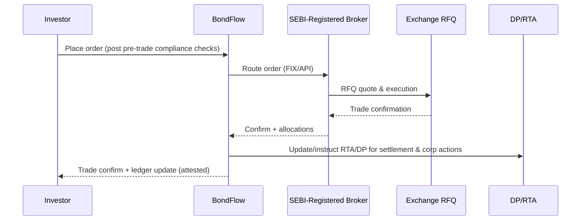
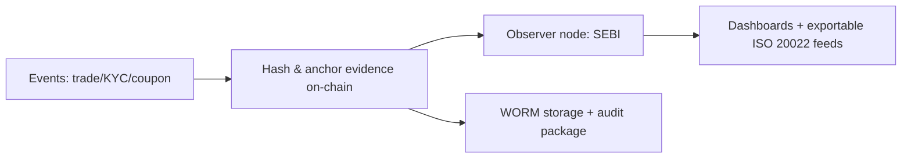

# BondFlow Regulatory Compliance — Strategy, Controls, and Mappings

Built compliance-first to align with SEBI, RBI, FIU-IND, and Indian data/privacy laws. Compliance is embedded in tech, ops, and governance — not an afterthought.

## Executive Snapshot
- Perimeter: SEBI-regulated Online Bond Platform Provider (OBPP) model, routed via exchange RFQ, with AML/KYC, DPDP-grade privacy, and regulator visibility by design.
- Primary regs touched: SEBI NCS/LODR/OBPP Circulars, PMLA + AML/CFT, DPDP Act 2023, Depositories & Participants, Debenture Trustees, KRA/KYC, CERT-In directions, RBI PA/PG (via partners), FEMA (future cross-border).
- Outcomes: Investor protection, market development, high-quality supervision data, and audit-grade evidence for all critical events.

---

## 0) Regulatory Perimeter & Licensing Plan

- Online Bond Platform Provider (OBPP)
  - SEBI framework (Nov 2022): OBPPs to be registered as stock brokers (debt segment) and route secondary bond transactions via exchange RFQ platforms (e.g., NSE/BSE).
  - BondFlow approach: Register as Stock Broker (Debt) OR partner with a SEBI-registered broker; integrate tightly with RFQ and clearing/settlement flows.
- Depositories & Demat
  - Securities remain dematerialized at NSDL/CDSL; BondFlow acts as intermediary/custodian via RTA/DP partners; ledger tokens represent beneficial interest with legal docs tying to depository position.
- Payment Flows
  - No cash acceptance; first-party funding only. UPI/RTGS/NEFT through regulated banks/payment aggregators.
  - If collecting funds: operate via RBI-compliant Payment Aggregator (PA) partner with nodal/escrow accounts and strict reconciliation.
- Data Privacy
  - DPDP Act 2023: BondFlow acts as Data Fiduciary; prepared for Significant Data Fiduciary obligations if thresholds met (DPO, DPIA, audits, grievance redressal).
- Cross-Border (Future Phases)
  - FEMA + RBI frameworks (NDI/DI Rules), FPI/NRI routes, IFSC access; enabled only post-legal clearance and product scoping.

---

## 1) Alignment with SEBI’s Mandate

### 1.1 Investor Protection
- Transparency: Permissioned blockchain with immutable logs; full trade/ownership lineage; regulator node for read/audit.
- Fraud & Market Abuse Detection: AI + rules + GNNs for wash/circular trades, layering, 3rd-party funding, pump-dump adjacency.
- Suitability & Disclosures: Appropriateness checks, risk disclosures, KFS-style summaries for retail; coupon/default/interest-rate risk explained.
- Cybersecurity: HSM-backed keys, RBAC/ABAC, SIEM/UEBA, AppSec in CI/CD; SEBI cyber resilience practices adopted.
- Grievance Redressal: In-app ticketing, SLA tracking, SCORES integration, Online Dispute Resolution (ODR) per SEBI’s framework.

### 1.2 Market Development
- Financial Inclusion: Fractional access to corporate bonds; low entry barriers; vernacular education modules; DPI onboarding.
- Liquidity: AI matching + RFQ routing; reduced frictions; improved depth and tighter spreads.
- Lower Cost of Capital: Broader investor base, better price discovery → narrower spreads → potential issuer savings.
- Innovation: DLT for auditability; DPI (Aadhaar/PAN/KRA/DigiLocker) for frictionless, compliant onboarding.

### 1.3 Supervision
- Real-time Reg Data: Trade-level, participant-level, and alert-level feeds to SEBI via observer node; exportable ISO 20022-style event logs.
- Compliance by Design: Smart contracts enforce KYC allowlists, lockups, residency/eligibility partitions, and controller transfers if required.
- Auditability: Tamper-evident trails; Merkle-proof backed evidence for enforcement and audits.

---

## 2) Regulatory Sandbox & Engagement

- SEBI Regulatory Sandbox: Propose phased pilots with constrained scope; structured risk logs; shared KPIs; weekly cadence with SEBI.
- SEBI Innovation Sandbox / MII Sandboxes: Early connectivity and RFQ testing with NSE/BSE/NSDL/CDSL test environments.
- Deliverables: Test plans, risk registers, controls testing results, consumer protection guardrails, and post-pilot evaluation reports.

---

## 3) Key Regulations — Mapping to Controls

| Regulation/Framework | What It Covers | BondFlow Controls |
|---|---|---|
| SEBI OBPP Framework (2022) | Registration, routing via RFQ, disclosures | OBPP registration plan; RFQ integration; investor disclosures; SCORES/ODR |
| SEBI (Issue and Listing of Non-Convertible Securities) Regulations, 2021 (NCS) | Issuance/listing/offer docs | Only compliant ISINs; doc hashes on-chain; RTA/Trustee workflows |
| SEBI LODR, 2015 | Ongoing disclosures for listed debt | Corporate actions event feeds; trustee/RTA integration; audit trails |
| SEBI Debenture Trustee Regulations, 1993 | Trustee roles, monitoring | Trustee APIs; covenant/rating oracles; event triggers and alerts |
| SEBI Depositories & Participants Regulations, 2018 | Demat, DP norms | DP/RTA connectivity; daily reconciliation; exception queues |
| SEBI KYC/KRA Regulations + Circulars | KYC capture, KRA validation | Aadhaar (offline/e‑KYC), PAN, CKYC/KRA, V-CIP; audit logs |
| PMLA 2002 + AML/CFT | CDD, screening, monitoring, STR | Sanctions/PEP/Adverse media; rules + ML; MLRO workflow; FIU-IND filings |
| DPDP Act 2023 | Privacy, consent, rights, security | DPO; DPIA; consent mgmt; minimization; encryption; rights handling |
| CERT-In Directions (Apr 2022) | Log retention and incident reporting | 180-day India log retention; incident reporting SLA; IR playbooks |
| RBI PA/PG (if applicable) | Payment aggregator rules | PA partnership; escrow/nodal; T+1/T+0 reconciliation; KYC on payouts |
| FEMA/NDI/DI (future) | Cross-border participation | Gating rules; residency partitions; FPI/NRI paths (if enabled) |
| PFUTP/PIT Regulations | Market conduct, UPSI handling | Surveillance analytics; Chinese walls; staff dealing code; blackout windows |

Note: ILDS regulations are now subsumed by NCS Regulations (2021).

---

## 4) Compliance-by-Design Controls (Tech + Process)

- Pre-Trade Gating: Smart contracts enforce KYC status, investor category, residency, lockup, and suitability rules.
- RFQ Routing: All secondary executions flow via exchange RFQ to remain squarely within the SEBI perimeter.
- On-Chain Evidence: Document hashes (offer docs/term sheets), consent proofs, compliance attestations anchored on-chain (no raw PII).
- Controller Powers: Regulator/legal-ordered pause/forced transfer supported with auditable triggers.
- Dual Books Reconciliation: Ledger ↔ depository/RTA positions; break resolution with maker–checker.
- Policy Registry: Versioned rulesets for compliance controls; signed, time-locked upgrades.

---

## 5) Market Integrity & Conduct

- Surveillance: Rules + ML for circular/wash/self trades, spoofing-type patterns on RFQ, coupon-date gaming, rapid in/out layering.
- Insider/UPSI Handling (PIT): Access controls, staff trading policy, pre-clearance, trading windows, and logs; UPSI repository with role-based access.
- Conflicts of Interest: Chinese walls between issuer services, trading ops, and analytics; disclosures where applicable.
- Advertising & Communications: SEBI-compliant marketing; fair/true/not misleading; risk-heavy products flagged; disclaimers and no implied guarantees.

---

## 6) Investor Protection & Grievance Redressal

- Disclosures: KFS-style product cards; YTM, credit rating, duration, liquidity profile, fees, and tax treatment (incl. TDS).
- Appropriateness/Suitability: Investor profiling; thresholds/limits for retail; explainers in vernacular.
- Grievance Channels: In-app tickets → escalation → SEBI SCORES; ODR integration per SEBI’s ODR framework.
- Education: Gamified learning, nudges on interest-rate/credit risk, default scenarios, and recovery waterfalls.

---

## 7) Data Protection, Cybersecurity, and Ops Resilience

- DPDP Governance: DPO appointed; DPIA for high-risk processing; consent lifecycle; rights handling; localization in India.
- Security Stack: AES-256 at rest; TLS 1.2/1.3 in transit; HSM-backed keys; PAM, MFA; SAST/DAST/SCA in CI/CD; SBOM and dependency pinning.
- CERT-In Compliance: 180-day log retention in India; incident reporting timelines; clock sync; subscriber data fields readiness.
- BCP/DR: Multi-zone, active-active; RPO ≤ 5 min; RTO ≤ 30 min; biannual DR drills; resilience KPIs monitored.
- Vendor Risk: Due diligence for KRA/KUA/screening/cloud/payment partners; contracts aligned to DPDP and SEBI outsourcing guidance.

---

## 8) Tax & Reporting Interfaces

- TDS on Coupons: Deduct/depict under IT Act (e.g., s.193); issue Form 16A; quarterly 26Q filings; 26AS alignment.
- GST/Fees: Appropriate GST treatment for platform fees (if applicable).
- FATCA/CRS: Self-certifications, indicia checks; periodic reports where in scope.

---

## 9) Execution & Reporting Flows

### 9.1 Trade Execution via RFQ

### 9.2 RegTech Evidence & Reporting

---

## 10) Compliance Calendar (Illustrative)

| Frequency | Obligation | Owner | Notes |
|---|---|---|---|
| Daily | Sanctions/PEP delta screening | Compliance | Automated; exception queues |
| Daily | Depository/RTA reconciliation | Ops | Breaks with maker–checker |
| T+1 | RFQ trade files and reconciliations | Ops/Tech | Exchange/broker/DP |
| Monthly | Board/Management MIS on compliance & incidents | Compliance | KPIs + remedial actions |
| Quarterly | TDS 26Q returns; Form 16A issuance | Finance | IT Act timelines |
| Quarterly | Independent surveillance review | Compliance | Sample investigations |
| Annual | Policy review & training refresh | HR/Compliance | KYC/AML/InfoSec |
| Event-based | STR filing to FIU-IND | MLRO | No tipping-off; SLA-bound |
| Event-based | Incident reporting to CERT-In/SEBI | CISO/Compliance | As per materiality |

---

## 11) Internal Compliance Framework

- Governance
  - MLRO; DPO; CISO; Head of Compliance; Audit & Risk Committees; clear RACI matrix.
  - Independent internal audit; annual third-party compliance review.
- Policies (versioned)
  - AML/CFT, KYC & Onboarding, Market Conduct, Conflicts, Data Privacy, Cybersecurity, Vendor Risk, Business Continuity, Incident Response.
- Training
  - Mandatory induction + annual refresh; role-based modules; phishing and privacy drills.

---

## 12) Open Legal Considerations & Stance

- Tokenization & Legal Title
  - Ledger token = digital representation of beneficial interest; authoritative record in depositories (NSDL/CDSL) via RTA/DP. Legal agreements bind the two; independent legal opinion to back structure.
- Off-Exchange Transfers
  - All secondary trades routed via exchange RFQ to remain compliant; off-market peer-to-peer blocked.
- Cross-Border
  - Disabled by default; future enablement subject to FEMA/RBI/SEBI approvals (FPI/NRI paths) and settlement setup.

---

## 13) Risks & Mitigations

| Risk | Mitigation |
|---|---|
| Regulatory interpretation on fractional tokens | Legal opinions; stay within RFQ/depository perimeter; sandbox validation |
| Payment leg failures/reversals | Escrow with idempotent callbacks; bank SLAs; watchdog recon; auto-refund rails |
| Privacy leakage | DPDP controls; PII off-chain; private tx; ZK attestations for attributes |
| Smart contract or rule misconfig | Independent audits; timelocks; multi-sig governance; staged rollouts |
| Vendor/partner outages | Multi-partner strategy; failover playbooks; contractual uptime SLAs |
| Market abuse sophistication | Continuous model tuning; red-team simulations; shared intel with exchanges |

---

## 14) Implementation Roadmap (Compliance Milestones)

- Phase 1: Sandbox/POC
  - OBPP registration path initiated; broker partner live; RFQ integration in test; AML ruleset v1; DPDP baseline; SCORES-ready.
- Phase 2: Pilot
  - KRA/CKYC integrations; V‑CIP; trustee/corporate actions automation; ISO 20022 feeds; ODR live; surveillance ML v1.
- Phase 3: Scale
  - Full PA/escrow automation; regulator dashboards; ZK attribute attestations; cross-entity covenant/rating oracles; periodic independent assurance (ISO 27001/SOC 2).

---

## 15) Quick Reference: Reg-to-Control Map (Condensed)

| SEBI Mandate | BondFlow Mechanism |
|---|---|
| Investor protection | Suitability + KFS, SCORES/ODR, cyber resilience, transparent pricing |
| Market development | Fractional access, RFQ liquidity, DPI onboarding, education |
| Supervision | Regulator node, audit logs, ISO 20022 feeds, on-chain attestations |

---

## 16) Sample Disclosures & Guardrails

- No guaranteed returns. Prices of debt can fluctuate with interest rates, credit events, and liquidity conditions.
- Default/credit risk belongs to issuer; recovery subject to trustee and legal process.
- Secondary trades executed via exchange RFQ; settlement as per market infra rules.
- TDS may apply on coupon; net receipts displayed transparently.
- Clear fee schedule; no hidden charges; all fees disclosed pre-trade.
