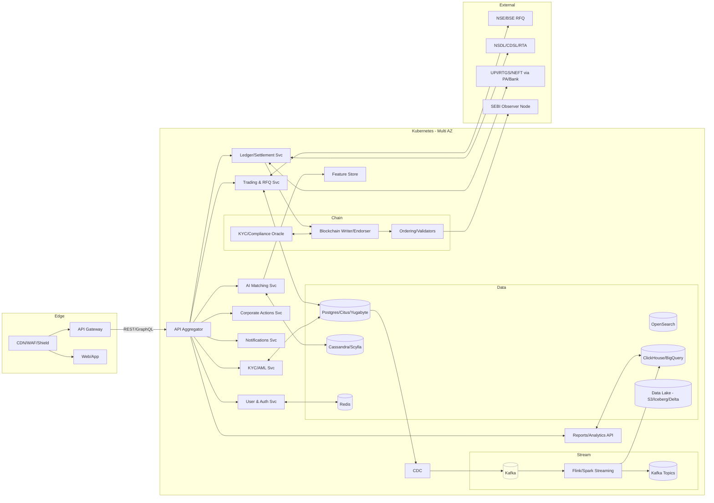

# BondFlow Scalability Strategy — Architecture, Capacity, and Ops

Built to handle millions of users and billions of events with low latency, high reliability, and strong security. Microservices + cloud-native + streaming backbone + permissioned blockchain = scale without losing compliance.

## Executive Snapshot
- Scale targets (indicative): 
  - App/API: 10–30k RPS peak; p95 latency ≤ 200 ms
  - Streaming: 50–150k events/sec sustained; 1–7 day hot retention
  - On-chain: 1k–3k TPS with sub-second finality (IBFT2/Fabric); off-chain DvP bounded by bank callbacks
- Availability: 99.95% baseline (99.99% for critical read paths), multi-AZ active-active; multi-region DR
- Data growth: TBs/day ingestion to lakehouse; affordable storage tiering with lifecycle policies
- Security: Zero-trust service mesh, HSM-backed keys, DPDP-compliant data boundaries

---

## 1) Architecture Blueprint

### 1.1 Macro View (Mermaid)


### 1.2 Patterns
- Domain-aligned microservices; explicit bounded contexts
- API composition at the edge; internal gRPC; external REST/GraphQL
- CQRS + Event Sourcing where auditability is key (orders, settlements)
- Outbox + CDC (Debezium) for reliable event propagation to Kafka
- Saga orchestration for multi-step workflows (trade → payment → token transfer)
- Idempotency keys for all write APIs; at-least-once event handling with dedupe

---

## 2) Microservices at Scale

- Independent scaling: HPA/VPA per service; Karpenter or Cluster Autoscaler for node elasticity
- Language/runtime fit-per-purpose: 
  - Trading/Settlement: JVM/Go for perf and GC control
  - KYC/Compliance: Python/Go; async IO for I/O-heavy flows
  - Matching/ML: Python + Ray/Triton; or Java/Scala for Flink jobs
- API reliability:
  - Circuit breakers, timeouts, hedged requests for tail latency
  - Retries with exponential backoff + jitter; per-call deadlines
  - Rate limits per-IP, per-user, per-device, per-API key

Example HPA (CPU + QPS custom metric):
```yaml
apiVersion: autoscaling/v2
kind: HorizontalPodAutoscaler
metadata:
  name: trading-svc
spec:
  scaleTargetRef:
    apiVersion: apps/v1
    kind: Deployment
    name: trading-svc
  minReplicas: 6
  maxReplicas: 60
  metrics:
    - type: Resource
      resource:
        name: cpu
        target:
          type: Utilization
          averageUtilization: 55
    - type: Pods
      pods:
        metric:
          name: requests_per_second
        target:
          type: AverageValue
          averageValue: "120"
```

---

## 3) Cloud-Native Foundations

- Kubernetes: Multi-AZ clusters, spot+on-demand mix with PDBs/PSPs/PodPriorities
- Service Mesh: Istio/Linkerd for mTLS, traffic shifting (canary), and telemetry
- API Gateway + WAF: AuthN/Z, JWT validation, DDoS/WAF rules, quota enforcement
- Serverless: Lambdas/Cloud Functions for bursts (notifications, exports, ETL triggers)
- Multi-Region DR: 
  - Primary: ap-south-1; Secondary: ap-south-2 (or nearby)
  - Async DB replication; Kafka MirrorMaker 2.0; object storage replication
  - RPO ≤ 5 min; RTO ≤ 30 min; DNS failover runbooks
- CDN: Static assets and cacheable APIs; edge keysets for config shards

---

## 4) Data Strategy — Polyglot Persistence

| Workload | Store | Scale Mechanism | Notes |
|---|---|---|---|
| User/Issuer/KYC profiles | Postgres (Citus/Yugabyte) | Sharding + replicas + partitioning | Strong consistency; row-level security |
| Orders/Trades/Allocations | Postgres (partitioned) | Time + hash partitions; logical replication | Online schema migrations (gh-ost/pt-osc) |
| Real-time telemetry/events | Kafka | Partitions per topic; consumer groups | Schema Registry (Avro/Protobuf), exactly-once sinks |
| Order book/cache | Redis | Clustered; sharded keys | Write-through + TTL; pub/sub |
| High-write time-series/metrics | ClickHouse/Timescale | Horizontal sharding | Compression; materialized views |
| Search & logs | OpenSearch/Elasticsearch | Shards/replicas; ILM | Short TTL hot, move to warm/cold |
| Large docs, lake | S3 + Iceberg/Delta | Virtually infinite | Object lifecycle, encryption, versioning |
| AML graphs | Cassandra/Scylla or Neptune | Wide-column / graph | GNN-ready; high write throughput |

Postgres partitioning example:
```sql
CREATE TABLE trades (
  trade_id BIGINT,
  account_id BIGINT,
  isin TEXT,
  qty NUMERIC(20,4),
  price NUMERIC(20,6),
  ts TIMESTAMPTZ
) PARTITION BY RANGE (ts);
```

---

## 5) Streaming & Real-Time Processing

- Kafka: 3–7 brokers/AZ; 50–150 partitions/topic for high-volume streams; acks=all; min.insync.replicas=2+
- Backpressure: Consumer lag SLOs; pausing producers via quotas; KEDA autoscaling on lag
- Processing: Flink/Spark Streaming with exactly-once sinks (two-phase commit)
- Patterns:
  - CDC Outbox for reliable event emission
  - Dead Letter Topics with retention and replay tooling
  - Compaction topics for latest state, retention topics for history
- Schema Governance: Confluent/Apicurio registry; compatibility rules set to backward

KEDA scaler (Kafka lag):
```yaml
triggers:
  - type: kafka
    metadata:
      bootstrapServers: kafka:9092
      consumerGroup: trade-consumers
      topic: trades
      lagThreshold: "10000"
```

---

## 6) Caching & Performance

- Multi-tier caching: 
  - CDN edge (static + cacheable GETs with ETags)
  - Redis for hot datasets (order books, quotes, investor dashboards)
  - DB materialized views for heavy aggregations
- Payload optimization: gRPC for internal; JSON over REST compressed (gzip/br); selective projection fields
- N+1 avoidance: DataLoader-like batching; join decomposition; careful index design (covering indexes, partial indexes)
- Precision: NUMERIC/decimal for money; UTC everywhere; monotonic IDs via Snowflake-style generators

---

## 7) Blockchain Scalability

- Permissioned chain (Quorum/Polygon Edge IBFT2 or Hyperledger Fabric)
  - Block time tuning (e.g., 500–800 ms) for latency/throughput balance
  - Validator set: 5–11 nodes across consortium members; observer node for SEBI
  - Private transactions (Tessera) or Fabric channels for sensitive trades
- Write Path Optimization:
  - Settlement orchestrator batches non-critical attestations; critical DvP steps remain atomic
  - State pruning/archival nodes; snapshotting for fast sync
- Future:
  - L2/off-chain channels for micro-events; periodic state anchoring
  - Sharding by asset class/ISIN families if consortium grows

---

## 8) AI/ML at Scale

- Training:
  - Distributed training (PyTorch/TensorFlow) on managed GPU clusters; Ray/Kubeflow pipelines; spot-aware with checkpointing
  - Data diet: feature store (Feast) syncing online/offline; PII minimization; bias/variance checks
- Inference:
  - Triton/Ray Serve with dynamic batching; autoscale on QPS/GPU util; A/B & canary models
  - Feature caching (Redis) and request coalescing to trim tail latencies
- Governance:
  - Model registry, lineage, drift detection, shadow deployments; rollbacks in seconds
  - Explainability where required (SHAP/LIME) for compliance-relevant decisions

---

## 9) Reliability & Resilience

- SLOs (illustrative):
  - API success rate: 99.95% monthly; p95<200ms, p99<400ms for read
  - Trade placement end-to-end: p95<800ms (excluding bank callbacks)
  - Kafka consumer lag: < 5k msgs for core topics (steady-state)
  - RPO/RTO: 5 min / 30 min
- Patterns:
  - Circuit breakers, bulkheads, async fallbacks
  - Retries with idempotency; outbox to avoid lost updates
  - DLQ + automated replay; compensation steps in sagas
- Chaos & GameDays: Fault injection (pod kill, network partition) quarterly; DR drills biannually

---

## 10) Observability & Ops

- Telemetry: OpenTelemetry for traces/metrics/logs; Tempo/Jaeger + Prometheus + Loki/OpenSearch; golden signals and RED/USE dashboards
- Alerting: SLO-based multi-window, multi-burn-rate alerting; pager via OpsGenie/PagerDuty; runbook links on every alert
- Cost & FinOps: 
  - Rightsizing, autoscaling; spot where safe; storage tiering; Parquet + ZSTD
  - Unit economics dashboards (cost per trade, per active user)
- Infra as Code: Terraform + GitOps (ArgoCD); policy-as-code (OPA/Gatekeeper) for guardrails
- Release Engineering: 
  - Blue/green + canary at mesh; feature flags; shadow traffic
  - Zero-downtime migrations; contract tests; SBOM + supply chain (SLSA)

---

## 11) Security at Scale

- Network: Zero-trust, mTLS everywhere; least-privileged SGs/NSGs; egress controls
- Secrets & Keys: KMS/HSM; short-lived tokens; sealed secrets; key rotation policies
- AppSec: SAST/DAST/SCA in CI; container/image signing and scanning; dependency pinning
- WAF/DDoS: CDN/WAF/Shield; bot management; anomaly detection at edge
- DPDP Boundaries: PII split stores; tokenization/pseudonymization; field-level encryption; audit logging with tamper-evidence
- CERT-In: 180-day log retention in India; incident reporting playbooks

---

## 12) Capacity Planning — Quick Guide

| Layer | Baseline | Scale Lever | Bottleneck Watch |
|---|---|---|---|
| API | 10–30k RPS | HPA + gateway shards | P95 latency, DB connections |
| Kafka | 50–150k ev/s | Partitions + brokers + disk IOPS | ISR health, page cache, GC |
| Postgres | 5–10k TPS writes | Partitioning + replicas + Citus | Autovacuum, hotspots, lock waits |
| Redis | < 1 ms ops | Cluster shards | Evictions, hit ratio |
| ClickHouse | 10–50k rows/sec ing | Shards + MV pipelines | Merge backlog, disk throughput |
| Blockchain | 1–3k TPS | Validator count + block time | Mempool, endorsement lag |

---

## 13) Performance Testing & Bench

- Tooling: k6/Locust for API; Gatling for gRPC; tc/netem for network chaos
- Method:
  - Staircase load + spike; find knee points; record CPU/mem/GC
  - Soak tests (4–12h) for leaks; chaos during soak
- Targets (indicative):
  - Pre-trade validation API: p95 ≤ 120 ms under 8k RPS
  - Order submit: p95 ≤ 180 ms under 3k RPS (excluding on-chain/UPI)

---

## 14) Data Lifecycle & Governance

- Tiering: 
  - Hot: 1–7 days (Kafka, Redis, hot Postgres partitions)
  - Warm: 30–90 days (ClickHouse/OpenSearch warm)
  - Cold: S3 Glacier with index manifest (Iceberg/Delta)
- TTL & ILM: Auto-expire non-regulatory data; WORM for evidentiary logs
- CDC to Lake: Debezium → Kafka → Flink → Iceberg tables; schema evolution with contracts
- PII governance: Tagging, access policies, masking in non-prod; synthetic data for tests

---

## 15) Example Config Snippets

API Idempotency header
```http
POST /v1/trades
Idempotency-Key: 2b0c1b6e-9cec-4db7-9b4e-3a02b6c9a1f1
```

Gateway rate-limit (pseudo)
```yaml
limits:
  trade_submit:
    key: user_id
    burst: 50
    rate: 10/s
  kyc_submit:
    key: ip
    burst: 20
    rate: 5/m
```

---

## 16) Release & Change Safety

- Progressive delivery: 1% → 10% → 50% → 100% with automated rollback on SLO breach
- DB migrations: Dual-write/read-compat windows; feature-flagged cutovers
- Config safety: Typed configs; validation at CI; dynamic reload; kill switches for risky features
- Audit: Every change is tied to ticket/PR; SBOM artifact attached; 4-eyes approval on prod

---

## 17) Roadmap (Scale-Out)

- Phase 1 (POC): Single-region, multi-AZ; Kafka+Flink; partitioned Postgres; Redis; baseline HPA; p95<250 ms
- Phase 2 (Pilot): Canary deploys; ClickHouse/Feature Store; KEDA-based autoscaling; chaos tests; 99.95% SLO
- Phase 3 (Scale): Multi-region DR; MirrorMaker; observer node for regulator; 10–30k RPS; 50–150k ev/s
- Phase 4 (Optimization): Cost tuning, spot expansion, L2 state anchoring on-chain, graph-store for AML at scale
- Phase 5 (Global-ready): Cross-region active-active read paths; FEMA-compliant cross-border (if enabled)

---

## 18) KPIs & Dashboards

- Business: Orders/min, filled %, average spread, cost per trade, DAU/MAU
- Reliability: Error budgets, SLO compliance, incident MTTR/MTTD
- Perf: API p95/p99, Kafka lag, DB QPS, cache hit ratios
- Security/Privacy: WAF blocks, IAM drift, PII access audits
- FinOps: $/RPS, $/ev/sec, storage $/TB-month

---

## 19) Extra Beef & Best Practices

- Consistency choices: Strong for trades/positions; eventual for analytics/feeds
- Precision safety: Decimal-only for money; no floats; fixed rounding rules
- Time safety: UTC only; NTP sync; monotonic clocks for ordering
- Duplicate defense: Idempotency + de-dup tables; unique request IDs
- Graceful degradation: Read-only mode, queue-and-drain, partial feature disables
- Vendor resilience: Multi-provider for screening/payments; circuit breakers around 3P APIs
