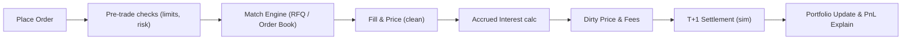

# Practice Playground — Learn by Doing (BondFlow)

A zero-risk sandbox to practice fractional bond trading, master bond math, and build intuition before you go live. Realistic mechanics, simulated data, instant feedback.

## Why you’ll love it
- Virtual money, real mechanics: Trade fractional bonds with a simulated RFQ/order book and corporate actions
- Learn by doing: See how rates, spreads, and liquidity move prices and yields
- Safe experiments: Try strategies, make mistakes, and iterate—no real money involved
- Built-in coach: Bite-sized lessons, nudges, and “explain my PnL” breakdowns
- Gamified: Challenges, badges, leaderboards, and streaks keep you motivated

---

## How it works

1) Virtual Money
- You get a virtual balance on entry (e.g., ₹10,00,000 demo cash). It’s not real money—can’t be withdrawn or converted.
- Daily/weekly top-ups for continued practice. Reset any time.

2) Simulated Market Data
- Synthetic-yet-realistic price paths driven by interest rates, credit spreads, and liquidity regimes.
- Historical replays available for classic scenarios (e.g., rate hikes, credit scares).
- Not live data—controlled for learning objectives.

3) Simulated Matching
- Two execution modes: Sim-RFQ (request quotes) and Sim-Order Book (continuous).
- Engine simulates quotes, depth, slippage, fees/taxes, and fills based on your order type and market conditions.

4) Portfolio Tracking
- Clean/dirty pricing, accrued interest, realized/unrealized PnL, yield, duration, convexity, DV01, and VaR (sim).
- Cash ledger and coupon flows with record/ex-div dates and TDS simulation.

5) Experimentation
- Toggle rate shocks, spread changes, liquidity squeezes, downgrades, and call/put events.
- Compare strategies: laddering, barbell, roll-down, carry, and duration targeting.

---

## Learning modes

- Guided Path (Beginner → Pro)
  - Short lessons, interactive quizzes, and mini-trades to apply concepts step-by-step.
- Free Play
  - Full sandbox; choose instruments, build your portfolio, and explore scenarios.
- Challenge Mode
  - Time-bound goals with constraints (budget, max drawdown, allowed instruments).
- Tournament Weeks
  - Leaderboards and cohorts; climb via risk-adjusted returns (Sharpe, hit rate, max DD).

---

## Scenario Library (pick your challenge)

- Rate Shock: RBI hikes +100 bps—test short-duration hedges
- Credit Downgrade: AA → A event—watch spread widening hit prices
- Liquidity Crunch: Wider bid–ask spreads and thin depth—execution matters
- Callable Surprise: Early call triggers reinvestment risk
- Inflation Pop: Curve bear-flattens—impact on 3Y vs 10Y bonds
- Risk-On Rally: Spreads tighten—carry and roll-down shine
- Tax Season: Demand shift changes curve kinks around FY-end

---

## Instruments (sim universe)
- Government: G-Secs across tenors, SDLs
- PSU/AAA: High quality, tight spreads
- Corporates: AA/A/BBB tranches with varying liquidity
- Special: Perpetuals (AT1), floaters, zeros/strips, callable/puttable issues

---

## Execution mechanics

- Order Types: Market, limit, RFQ, IOC/FOK, stop (learning context), OCO (advanced)
- Costs: Simulated fees, taxes, and realistic slippage based on depth and urgency
- Clean vs Dirty: Orders placed on clean price; settlement uses dirty price (clean + accrued)
- Settlement: Simulated T+1/T+2; corporate actions affect eligibility via record dates

---

## Analytics and tools
- Position metrics: YTM/YTC, duration, convexity, DV01/PVBP, carry+roll-down
- Risk views: Heatmap by rating/tenor; concentration flags; liquidity score
- PnL explainers: Split by coupon income, price move, convexity, fees/slippage
- What-if calculators: +/− bps shocks, credit spread shifts, call/put exercise
- Tax view (sim): TDS on coupon; indicative post-tax yields (educational only)

---

## Coaching and nudges
- Explain My Fill: Why you got partial fill or slippage (depth, order type, urgency)
- Risk Alerts: “High duration for your horizon” or “Concentration > 25% in one issuer”
- Learning Cards: 30–60s concepts embedded inline (e.g., clean vs dirty, day-count)
- “Why did price move?”: Rates vs spread attribution for daily changes

---

## Gamification

- XP & Badges
  - Ladder Master: Build a 2–10 year ladder with duration in target band
  - Spread Hunter: Monetize a 30 bps tightening with defined risk
  - Risk Manager: Keep max drawdown < 3% over 30 days
  - Coupon King/Queen: Optimize cashflows across 2 quarters
- Leaderboards
  - Risk-adjusted return (Sharpe), hit rate, average slippage, drawdown discipline
- Streaks
  - Daily practice streaks unlock advanced scenarios and tooltips

---

## Example challenges

- 7-Day Rate Hike Sprint
  - Goal: Preserve capital after a +100 bps shock; keep MDD < 2%; finish with positive PnL
- Credit Scare Playbook
  - Goal: Reduce exposure to at-risk issuer; redeploy into safer spread; document thesis
- Roll-Down Carry Trade
  - Goal: Exploit curve shape for positive carry/roll-down; exit before call window

---

## Getting started

1) Enter Playground in-app
2) Claim demo cash
3) Pick a mode (Guided/Free/Challenge)
4) Place your first trade (we’ll guide you through clean vs dirty and accrued)
5) Review PnL and learn from “Explain My PnL”
6) Repeat with scenarios and unlock badges

---

## Fair play, privacy, and safety

- Zero real money; no KYC required for Playground usage
- Educational only; simulated results do not predict real outcomes
- No personal financial advice; portfolio tips are generic learning aids
- DPDP-friendly: Minimal data; learning telemetry anonymized/aggregated
- Reset anytime; exports available for your notes

---

## Under the hood (how the sim works)

- Price Engine
  - Rates: Short-rate process (e.g., Vasicek/CIR) drives the curve
  - Spreads: Regime-switching Markov model + jump events for downgrades
  - Liquidity: Depth/spreads vary by rating/tenor and regime (risk-on/off)
- Matching Engine
  - RFQ: Simulated dealer responses (latency, skew, rejection probability)
  - Order Book: Stochastic depth; market impact for large orders
- Corporate Actions
  - Coupon accrual, ex/record dates, dirty-settlement, TDS simulation
- Risk/Perf Metrics
  - Duration/convexity calc, DV01, scenario shocks, MDD, and Sharpe (sim)

---

## Educator/Cohort mode (optional)
- Cohort challenges, private leaderboards, instructor dashboards
- Custom scenarios and rubrics; exportable reports

---

## Roadmap (Playground)

- Phase 1: Core sim (rates/spreads/liquidity), guided lessons, PnL explainers
- Phase 2: Advanced instruments (perps/floaters), tournaments, historical replays
- Phase 3: Strategy backtesting, social sharing of playbooks (no advice), educator mode
- Phase 4: AI Coach 2.0—personalized lessons from your mistakes; voice chat

---

## Sample scenario spec (YAML)

```yaml
id: rate_hike_100bps_week
label: RBI Surprise +100 bps
horizon_days: 7
universe:
  ratings: [AAA, AA, A]
  tenors: [2Y, 5Y, 10Y]
market_model:
  rates:
    model: vasicek
    params: { kappa: 0.4, theta: 0.075, sigma: 0.01 }
    shock_bp_day1: +100
  spreads:
    regime: risk_off
    base_bp: { AAA: 80, AA: 130, A: 190 }
    volatility_bp: 15
liquidity:
  depth: { AAA: high, AA: medium, A: low }
  bid_ask_bp: { AAA: 8, AA: 15, A: 30 }
rules:
  max_drawdown_pct: 2.0
  allowed_instruments: [GSEC, PSU_AAA, CORP_AA]
goals:
  pnl_min_pct: 0.0
  duration_target_years: [1.0, 3.0]
```

---

## Order-to-settlement (Playground flow)



---

## Quick tips to win the Playground
- Match horizon to duration: Short horizon? Keep duration shorter.
- Respect liquidity: Thin depth = larger slippage; use limits or RFQ.
- Watch call schedules: A juicy coupon can disappear if called.
- Diversify: Across issuers, sectors, and tenors—reduce concentration shocks.
- Review PnL daily: Separate coupon income from price moves to learn faster.

